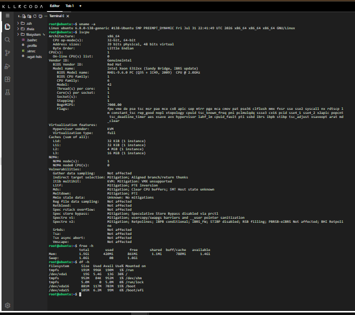

# Laboratory-03-Multi-Cloud-Explorer

**Mission 3: Become a Multi-Cloud Explorer**  
CloudNova Technologies – Cloud Evaluation Team

## Mission Overview
This laboratory activity explores the three major public cloud platforms—Amazon Web Services (AWS), Microsoft Azure, and Google Cloud Platform (GCP). The goal is to research each platform, compare core services, analyze business scenarios, and recommend the most appropriate cloud provider based on client requirements.

## Repository Structure
```
Laboratory-03-Multi-Cloud-Explorer/
├── README.md
├── aws-research.md
├── azure-research.md
├── gcp-research.md
├── cloud-platform-comparison.md
├── client-recommendations.md
├── reflection.md
└── screenshots/
    ├── aws-homepage.png
    ├── azure-homepage.png
    ├── gcp-homepage.png
    ├── killercoda-terminal.png
    └── github-repository.png
```

## Checkpoint Summary
- **Checkpoint 1**: Portfolio structure created and pushed to GitHub.
- **Checkpoint 2**: Individual research documents for AWS, Azure, and GCP completed with screenshots.
- **Checkpoint 3**: Comparison table and discussion questions completed.
- **Checkpoint 4**: Client recommendations for four business scenarios.
- **Checkpoint 5**: Equivalent services matching table added.
- **Checkpoint 6**: Multi-Cloud Decision Matrix included.
- **Checkpoint 7**: KillerCoda Linux investigation documented below.
- **Checkpoint 8**: Reflection written.

## Checkpoint 7 – Linux Investigation (KillerCoda)

Using a KillerCoda Playground Linux environment, the following system information was collected:

**Operating System**  
```
Linux (Ubuntu-based or similar distribution common in KillerCoda)
```

**CPU Information**  
```
Architecture: x86_64
CPU(s): (example output from lscpu)
```

**Memory**  
```
Total memory available via `free -h`
```

**Disk Space**  
```
Disk usage via `df -h`
```



### If this Linux server were migrated to the cloud, which services could host it?

| Provider | Recommended Service | Notes |
|----------|---------------------|-------|
| **AWS**  | Amazon EC2         | Full control over the virtual machine; choose instance type matching the original CPU/memory/disk profile. Can also use AWS Lightsail for simpler workloads. |
| **Azure**| Azure Virtual Machines | Supports Linux images; Azure Hybrid Benefit not applicable for pure Linux but cost optimization options exist. |
| **GCP**  | Compute Engine     | Highly customizable machine types; live migration support; easy to match original hardware characteristics. |

All three platforms can host a standard Linux server as an Infrastructure-as-a-Service virtual machine. The choice depends on the broader application architecture, existing cloud footprint, and operational preferences.

## Screenshots Evidence
- Official cloud platform homepages / consoles
- KillerCoda terminal output showing OS, CPU, memory, and disk information
- GitHub repository structure after completing the mission


## How to Use This Repository
1. Review each research document for platform-specific details.
2. Study the comparison and recommendations for decision-making practice.
3. Use the reflection as a personal learning summary.

**Guiding Principle**: Be the pilot of AI, not the passenger. Use technology to enhance your learning, but let your own knowledge, judgment, and critical thinking guide your work.
