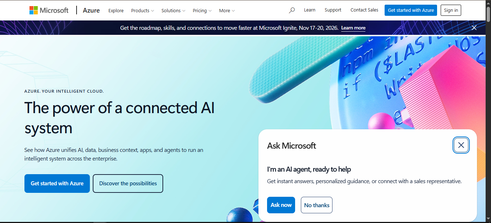

# Microsoft Azure Research

## Brief Overview
Microsoft Azure is a comprehensive cloud computing platform offering more than 200 products and services. Launched in 2010 (initially as Windows Azure), it provides IaaS, PaaS, and SaaS solutions. Azure is particularly strong in enterprise environments due to deep integration with Microsoft technologies such as Windows Server, Active Directory, Microsoft 365, and .NET. It is trusted by 95% of Fortune 500 companies.

## Global Infrastructure
Azure operates one of the largest cloud footprints with over 70 regions and more than 400 highly secure datacenters worldwide. It features extensive fiber connectivity (over 600,000 km) and supports hybrid and multi-cloud scenarios through Azure Arc and Azure Stack. This global presence enables low-latency deployments and compliance with data residency requirements in many countries.

## Cloud Management Console
The Azure Portal is a unified web-based console for managing Azure resources. It offers customizable dashboards, resource groups, Azure Resource Manager (ARM) templates, and integration with Azure CLI, PowerShell, and Azure DevOps. Features include cost management, security center (Microsoft Defender for Cloud), and monitoring via Azure Monitor.

## Four (4) Core Services
1. **Azure Virtual Machines**: On-demand, scalable computing resources that support Windows and Linux. Highly integrated with Active Directory and hybrid scenarios.
2. **Azure Blob Storage**: Massively scalable object storage for unstructured data such as text, binary data, images, and videos.
3. **Azure Virtual Network (VNet)**: Provides isolated, private networking in the cloud with support for hybrid connectivity via VPN Gateway and ExpressRoute.
4. **Microsoft Entra ID (formerly Azure Active Directory)**: Comprehensive identity and access management service that integrates seamlessly with on-premises Active Directory and Microsoft 365.

## Three (3) Advantages
1. **Seamless Microsoft Integration**: Native support for Windows, Active Directory, SQL Server, Microsoft 365, and Azure Hybrid Benefit for cost savings on existing licenses.
2. **Strong Hybrid and Multi-Cloud Capabilities**: Azure Arc allows management of resources across on-premises, multi-cloud, and edge environments from a single control plane.
3. **Enterprise Security and Compliance**: Extensive certifications and tools like Microsoft Defender for Cloud, making it ideal for regulated industries.

## Typical Enterprise Use Cases
- Organizations already using Microsoft 365 and Windows Server wanting hybrid cloud migration.
- Enterprise resource planning (ERP) and line-of-business applications.
- AI-powered applications leveraging Azure OpenAI Service and Microsoft Foundry.
- Government and regulated industries requiring sovereign cloud options.
- DevOps and application modernization using Azure Kubernetes Service (AKS) and GitHub integration.
