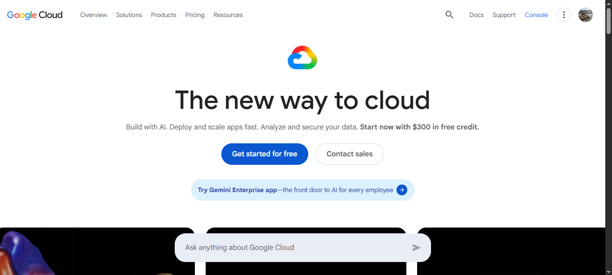

# Google Cloud Platform (GCP) Research

## Brief Overview
Google Cloud Platform (GCP) is a suite of cloud computing services that runs on the same infrastructure that Google uses internally for products like Search, Gmail, and YouTube. Launched in 2008 (with App Engine) and expanded significantly thereafter, GCP excels in data analytics, artificial intelligence/machine learning, and container orchestration. It emphasizes open-source technologies, clean APIs, and high-performance networking.

## Global Infrastructure
GCP operates across 40+ geographic regions with multiple availability zones per region. It leverages Google's private global fiber network (including extensive subsea cables) for low-latency and high-reliability connectivity. Premium Tier networking keeps traffic on Google's backbone for most of the journey. The infrastructure is designed for high security, energy efficiency, and sustainability.

## Cloud Management Console
The Google Cloud Console is a web-based interface for managing GCP resources. It features project-based organization, Cloud Shell (browser-based terminal), integrated monitoring and logging, and support for Infrastructure as Code via Deployment Manager or Terraform. The console is known for its clean design and strong developer experience.

## Four (4) Core Services
1. **Compute Engine**: Highly customizable virtual machines with live migration, custom machine types, and strong performance. Supports both Linux and Windows.
2. **Cloud Storage**: Unified object storage with options for multi-regional, regional, nearline, and coldline storage classes. Highly durable and integrated with other GCP services.
3. **Virtual Private Cloud (VPC)**: Global software-defined network that allows resources across regions to communicate as if on the same network, with fine-grained firewall rules.
4. **Cloud Identity / Identity and Access Management (IAM)**: Manages user identities and fine-grained access control to GCP resources. Integrates with Google Workspace.

## Three (3) Advantages
1. **Leadership in AI/ML and Data Analytics**: Best-in-class tools including Vertex AI, BigQuery (serverless data warehouse), and access to Google's TPUs and custom silicon.
2. **Superior Kubernetes Experience**: Google Kubernetes Engine (GKE) is widely regarded as the most mature managed Kubernetes service (Google created Kubernetes).
3. **High-Performance Global Network**: Google's private backbone delivers consistently low latency and high throughput, ideal for global applications and data-intensive workloads.

## Typical Enterprise Use Cases
- AI and machine learning research and production workloads (e.g., model training with Vertex AI).
- Large-scale data analytics and business intelligence using BigQuery.
- Containerized microservices architectures with GKE and Cloud Run.
- Media and entertainment companies processing and delivering content globally.
- Startups and tech companies seeking developer-friendly tools and open-source alignment.
